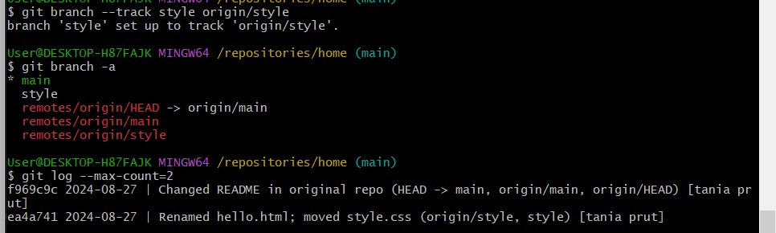

Прут Тетяна ІПЗ 4.03

"Вивчення Git"

Мета: Опанувати базові команди та принципи роботи з системою контролю версій Git, шляхом проходження курсу на githowto.com.
 
 Крок 1. Перед початком роботи ми налаштовуємо облікові дані  Git 

    1. імя та електронну адресу 

 
 

    2. налаштовуємо назву гілки за замовчуванням 

 

Крок 2. Створення проекту 

    за допомогою команди "cd" ми перехоодимо до порожнього каталогу "repositories"

    за допомогою команди  "mkdir" створюємо порожній підкаталог, переходимо до нього та за допомогою команди "touch" створюємо файл "hello.html"

 

    за допомогою команди "git init" створюємо сховище гіт із цього каталогу 

    git add - додаємо сторінку до  репозиторію 
    git commit - додаємо коментар 

 

 Крок 3. Перевірка стану репозиторію 

    git status - перевіряємо поточний статус сховища 
    Команда перевіряє статус і повідомляє, що немає нічого для фіксації, тобто репозиторій зберігає поточний стан робочого каталогу, і немає змін для запису.

    як результат ми бачимо що знаходимося на головній гілці, і нічого немає для фіксації. 

 

 Крок 4. Внесення змін

    в редакторі змінбємо вміст сторінки «Hello, World».

    після перерівки статусу, бачимо, що є зміни яки ми же не зафіксували в репозиторії 

Крок 5. Індексація змін

    Наступним кроком буде дати сторінку зі змінами до  репозиторію і слідом перевірити стан:

 

    Повідомлення нам переказує, що зміни файлу hello.html було проіндексовано. Тобто Git знає про зміни.

Крок 7. Коміт змін

    Тепер зробімо коміт того, що проіндексували у репозиторій.

    Вводимо команду git commit, але без –m як це було раніше. Тоді нас переносить у редактор:

    У першому рядку вводимо коментар Added h1 tag. Зберігаємо і виходимо:

 
 

    Далі перевіряємо стан та бачимо що директорія чиста 

 

 Крок 8. Зміни, а не файли

    Знову змінюємо вміст файлу, додаємо ці зміни в індекс Git, І знову змінюємо файл, додаючи заголовок. Перевіряємо статус 

 

    Повідомлення показує що файл згадано двічі. Перша зміна проіндексована і готова до коміту. Друга зміна (де додали заголовки) є непроіндексована.

    Якби зараз було зроблено коміт, заголовки не було б збережено у репозиторій. Це можна перевірити.

    Робимо коміт проіндексованих змін і ще раз перевіряємо стан:

 

    Команда статусу повідомляє, що у файлі досі є незбережені зміни.

    Додаємо другу зміну в індекс (перший рядок означає що було використано поточну директорію) і знову перевіряємо стан

 

    фіксуємо другу змінну

 

 Крок 9. Історія проєкту

    git log - Отримання списку внесених змін

 

    git log --oneline - осторія в один рядок 

 

    git log --pretty=format:"%h %ad | %s%d [%an]" --date=short - формат журналу  де 
        --pretty="..."визначає вихідний формат.
        %hце скорочений хеш коміту.
        %adє датою фіксації.
        |це лише візуальний роздільник.
        %sє коментар.
        %dприкраси фіксації (наприклад, головки гілок або теги).
        %anє ім'я автора.
        --date=shortзберігає короткий і приємний формат дати.

 

    Щоб кожного разу не вводити таку велику команду ми  налаштовуємо формат журналу за замовчуванням 

        git config --global format.pretty '%h %ad | %s%d [%an]'
        git config --global log.date short

Крок 10. Отримання старіших версій

    перевіряємо журнал даних та знаходимо хеш початкового коміту (останній рядок вихідних даних). Використовуємо його в команді "git checkout <hash>". Команда git checkout <hash> перемикає репозиторій на стан, який відповідає певному коміту (зазначеному хешем). Це дозволяє переглянути або відкотитися до минулого стану проекту.

    Команда cat hello.html виводить вміст файлу hello.html у терміналі.

 

    Повернімося до останньої версії коду, перемикаючись на гілку за замовчуванням main, за допомогою команди нижче, і перевіримо вміст файлу:

 

Крок 11. Теги версій

    git tag v1 - називаємо поточку версію сторінки v1 

    Теги для попередніх версій

    Замість того, щоб шукати хеш коміту, ми будемо використовувати ^нотацію, зокрема v1^, вказуючи на коміт перед v1.

    git checkout v1^ — перехід до коміту перед міткою v1.
    cat hello.html — перегляд вмісту файлу hello.html у терміналі.

    назвиваємо версію, що передує поточній, назвою v1-beta. Перш за все ми перевіримо попередню версію.

    Команди git checkout v1 та git checkout v1-beta перемикають репозиторій на відповідні гілки або мітки.

    git checkout v1: Перемикає репозиторій на гілку або мітку v1.
    git checkout v1-beta: Перемикає репозиторій на гілку або мітку v1-beta.

    git tag - перевіряємо всі наявні теги 
    
    також перевіряємо теги в журналі 

    git log main --all

  

Крок 12. Відкидання локальних змін (перед постановкою)

    git switch main - перемикання на гілку main

    Вносимо зміни у hello.html файл у вигляді небажаного коментар

    git status - перевіряємо статус та бачимо, що файл було змінено, але ще не ініціовано

    git checkout hello.html - скасовує локальні зміни у файлі hello.html, відновлює файл дл його останнього збереженого стану в репозиторії.
    
    cat hello.html - відображає вміст файлу hello.html.

Крок 13. Скасуйте поетапні зміни (перед фіксацією)

    Вносимо  зміни у hello.html файл у вигляді небажаного коментаря. 
    Додаємо зміни до репозиторію (git add hello.html) та перевіряємо статус небажаних змін (git status). 

    Статус показує, що зміна була поетапна та готова до фіксації.

    Команда reset відкочує область підготовки до HEAD. Це очищає область підготовки від змін, які були проіндексовані. Проте, через те що ця команда не змінює робочу директорію, робоча директорія все ще містить небажаний коментар. 

    Використовуємо checkout команду, щоб видалити небажані зміни з робочого каталогу та перевіряємо статус. Наш робочий каталог знову чистий.

крок 14. Скасування комітів 

    знову змінюємо файл І робимо коміт: 

        git add hello.html
        git commit -m "Oops, we didn't want this commit"
    
    Для скасування коміту, нам необхідно зробити коміт, що видаляє зміни, збережені небажаним комітом.
    
    Вводимо git revert HEAD і переходимо до редактора.
    Перевіряємо лог, що показує небажані та скасовані коміти у нашому репозиторії.

Крок 15. Видалення коміту з гілки 

    Перевіримо історю комітів (git log)

    Видалімо два останні коміти за допомогою команди reset.

    Але спершу позначемо останній коміт тегом, для зручного пошуку (git tag oops)

    Повідомлення логу показує, що коміт з тегом v1 є попереднім комітом до помилкового.

    Скиньмо гілку до цієї точки. Оскільки гілка має тег, ми можемо використовувати ім'я тегу в команді відкоту reset (якщо вона не має тега, ми можемо використовувати хеш коміта). (git resrt --hard v1)

    --hard – параметр аби повністю скинути стан робочої директорії до того, як було вказано в зазначеному коміті (у цьому випадку, до тега v1). В лозі бачимо що вже немає комітів "Revert Oops" і "Oops".

    Але якщо ми подивимось на всі коміти то побачимо що помилкові коміти не зникли, вони просто відсутні в гілці main 

Крок 16. Видалення тегу Oops 
    
    Після видалення більше не буде відображатися у репозиторії

Крок 17. Внесення змін

    РОзміщуємо авторський коментар на сторінці. 
    Додаємо коміт да перевіряємо історію. 

    Знову змінюємо файл та додаємо електронну адресу. 
    Так як ми не хочемо створувати новий коміт, ми змінуємо попередній. Опція --amend в Git використовується для зміни останнього коміту. Вона дозволяє додати нові зміни або виправити повідомлення коміту без створення нового коміту.

 

Крок 18. створення гілки

    git switch -c style - створює і перемикає вас на нову гілку style

    touch style.css - додаємо файл style.css

    Редагуємо створенний файл. Додаємо коміт. Також змінюємо файл hello.htmlдля використання style.css. 

    Тепер у нас є нова гілка styleз двома новими комітами. У наступному уроці ми побачимо, як переключатися між гілками.

 

Крок 19. Перемикання гілок 

    git log --all - перевіряємо історію двох  гілок
    git switch main - повертаємся на гілку main
    cat hello.html - перевіряємо вміст файлу hello.html (на цій гілся hello.html не має жодних слідів style.css.)

    git switch style - повертаємося до style гілки
    cat hello.html - знову перевіряємо вміст файлу hello.html, наші зміни, пов’язані з CSS, присутні.

 
    
Крок 20. Переміщення файлів 

    Перевіряємо журнал змін для hello.html файлу за допомогою команди git show v1

    diff --git a/hello.html b/hello.html - показує, що порівнюються дві версії файлу hello.html (до і після змін).

    @@ -1,4 +1,6 @@ - показує контекст змін: починаючи з першого рядка, у старій версії було 4 рядки, а у новій - 6 рядків.

    Рядки, позначені +, є новими і були додані в цьому коміті.

    mv hello.html index.html - змінюємо назву файлу
    git status -  перевіряємо статус

    !!Git інтерпретує нашу модифікацію так, ніби ми видалили файл і створили новий!!

    git add . - додаємо файл 
    git status - знову перевіряємо статус

 

    mkdir css - створуємо ноий каталог css 
    git mv style.css css/style.css - переміщуємо файл style.css з кореневої директорії в підкаталог css, змінюючи його шлях на css/style.css
    git status -  перевіряємо статус
    git commit -m "Renamed hello.html; moved style.css" - зберігаємо зміни
    git log css/style.css - перевіряємо історію
    git log --follow css/style.css -  відображає історію змін для файлу css/style.css, враховуючи його попередні імена, якщо файл був перейменований або переміщений.

 

Крок 21. Зміни у main відділенні

    створюємо README файл (touch README.md)
    git switch main - перемикаємося на гілку main
    git add README - додаємо файл до індексу
    git commit -m "Added README" - створуємо коміт з повідомленням 

Крок 22. Перегляд розбіжних гілок 

    git log --all --graph - відображає всі коміти в репозиторії з графічним відображенням історії гілок. Це дозволяє візуально бачити, як коміти пов'язані між собою і як гілки зливаються або розходяться.
        --all - показує всі коміти з усіх гілок.
        --graph - відображає графічну діаграму, що показує, як коміти пов'язані між собою.

 

Крок 23. Злиття

    git switch style - перемикаємося на гілку style
    git merge main - об'єднуємо зміни з гілки main у поточну гілку
    git log --all --graph - всі коміти в репозиторії з графічним відображенням історії гілок

 

Крок 24. Створення конфлікту злиття

    git switch main - перемикаємося на гілку main

    вносимо зміни у файл hello.html

    git log --all --graph - всі коміти в репозиторії з графічним відображенням історії гілок

 

     git switch style - перемикаємося на гілку style
     git merge main -   об'єднуємо зміни з гілки main у поточну гілку. У нас конфлікт. 
     перевіряємо статус та файл index.html.

  

    git merge --abort - скасовуємо процес злиття

    Щоб вирішити конфлікт, нам потрібно відредагувати файл до стану, який нас задовольняє, а потім зафіксувати його як зазвичай. У нашому випадку ми об’єднаємо зміни з обох гілок.

    Фіксуємо вирішений конфлікт:
    git add index.html
    git commit -m "Resolved merge conflict"
    git status
    git log --all --graph

  

Крок 27. Відкочування гілки style
    Слід повернутись у гілку style до точки перед тим, як ми злили її з гілкою main. Можемо відновити гілку до будь-якого коміту за допомогою команди reset.

    У цьому випадку ми хочемо повернутися в гілці style в точку перед злиттям з main. Нам необхідно знайти останній коміт перед злиттям

    Повідомлення пише, що коміт «Renamed hello.html; moved style.css» був останнім у гілці style перед злиттям.

    Далі скидаємо гілку style до цього коміту. Для посилання на цей коміт ми визначаємо, що цей коміт знаходиться за 2 коміти до HEAD, тобто HEAD~2 у нотації Git.

    Тепер перевіримо історію змін у гілці style

Крок 28. Перебазувати 

    Команда git rebase використовується для інтеграції змін з однієї гілки в іншу, але в спосіб, відмінний від злиття. Якщо ви використовуєте команду git rebase main, ви переносите зміни з поточної гілки на верхівку гілки main. Це може бути корисно для підтримки чистої історії комітів і уникнення надмірних злиттів.

    Бачимо що знову виник конфлікт, що стався в hello.html, а не в index.html, як минулого разу. Це тому, що rebase був у процесі застосування змін style поверх гілки main. У той момент в гілці main ще не було перейменовано файл hello.html, тому він все ще має стару назву.

    При злитті виник би "зворотній" конфлікт. Під час злиття зміни гілки main були б застосовані поверх гілки style. У гілці style файл перейменовано, тому конфлікт виник би у файлі index.html

    По-перше, редагуємо файл hello.html так як треба. Але після цього не потрібно комітити зміни. Можемо просто додати файл до індексу (git add .) і продовжити процес перебазування (git rebase --continue).

  

 Крок 29. Злиття до main гілки

    Виконуємо злиття style в main, потім переглядаємо логи

 

    Тепер гілки style і main ідентичні.

Крок 30. Перейдімо в директорію repositories:

    cd ..: Переходить на один рівень вище в ієрархії директорій.
    pwd: Виводить абсолютний шлях до поточної директорії.
    ls: Переглядає вміст поточної директорії.

    git clone work home - створіємо клон репозиторію 
    ls

 

Крок 31. Вивчіть клонований репозиторій

    переходимо в наш клонований репозиторій та перевіряємо його вміст.
    бачимо список усіх файлів на верхньому рівні вихідного сховища ( README, index.html,  css)

    переглядаємо історію клонованого сховища. 
    бачимо список усіх комітів у новому сховищі, і він збігається з історією комітів оригінального репозиторію. Різниця є лише в назвах гілок.

 

Крок 32.Що таке походження?
    
    Переглянемо список віддалених репозиторіїв, які налаштовані для локального Git-репозиторію:

 

    Бачимо, що клонований репозиторій знає про ім'я за замовчуванням віддаленого репозиторія.

    Подивимось, чи можемо отримати більш детальну інформацію про ім'я за замовчуванням

    Бачимо, що «ім'я за замовчуванням» віддаленого репозиторія — початкове work.

Крок 33. віддалені гілки 

    git branch - перевіряємо гілки в клонованому сховищі
    git branch -a - викоистовуємо щоб побачити всі гілки 

 

Крок 34. Зміна вихідного репозиторію 

    cd ../work -  переходимо в оригінальне сховище 
    вносимо зміни в README файл 
    додаємо та фіксуємо цю зміну.

 

Крок 35. Отримання змін 

    Переходимо в репозиторії home:
    cd ../home
    git fetch - команда завантажує всі зміни з віддаленого репозиторія, що зазвичай називається origin, і оновлює локальні копії віддалених гілок, але не змінює ваші локальні гілки

    Клонований файл README не змінився (cat README)

 

Крок 36. Об'єднання витягнутих змін

    git merge origin/main - об'єднуємо отримані зміни в локальну мейн гілку

    ще раз перевіряємо файл README

Крок 37. Додавання гілки відстеження 

    git branch --track style origin/style - створуємо локальну гілку style яка слідкує за origin/style
    git branch -a - переглядаємо всі гілки
    git log --max-count=2 - передивляємося останні два коміти 

Крок 38. Чисті репозиторії 

    cd .. 
    git clone --bare work work.git - клонуємо репозиторій як bare-репозиторій (репозиторій, який не містить робочого дерева (тобто, не містить файлів, які можна редагувати))
    ls work.git - перевіряємо вміст 

Крок 39. Додавання віддаленого сховища

    cd work - перехід до каталогу ворк 
    git remote add shared ../work.git - додавання віддаленого репозиторію 

    Ця команда додала новий віддалений репозиторій під назвою shared, вказавши шлях до bare-репозиторія work.git, який знаходиться в батьківському каталозі. Тепер ви можете використовувати shared для взаємодії з цим віддаленим репозиторієм, наприклад, для передачі змін або отримання нових комітів.
   
Крок 40. Відправка змін

 змінюємо вміст файла README і робимо коміт змін:

    git switch main
    git add README
    git commit -m "Added shared comment to readme"

    git push shared main -  відправляємо зміни з вашої локальної гілки main до віддаленого репозиторію shared

Крок 41. Підтягування спільних змін

    Перейдемо в репозиторій home і підтягнемо зміни, щойно відправлені в спільний репозиторій

    git remote add shared ../work.git - після виконання цієї команди в локальному репозиторії буде налаштований новий віддалений репозиторій з ім'ям shared, який посилається на репозиторій за адресою ../work.git.

    git branch --track shared main - буде локальна гілка shared, яка автоматично відстежує гілку main з віддаленого репозиторію shared.

    git pull shared main - зміни з гілки main у віддаленому репозиторії shared будуть отримані та об'єднані з поточною локальною гілкою.

    cat README – і переглядаємо вміст файлу README.

